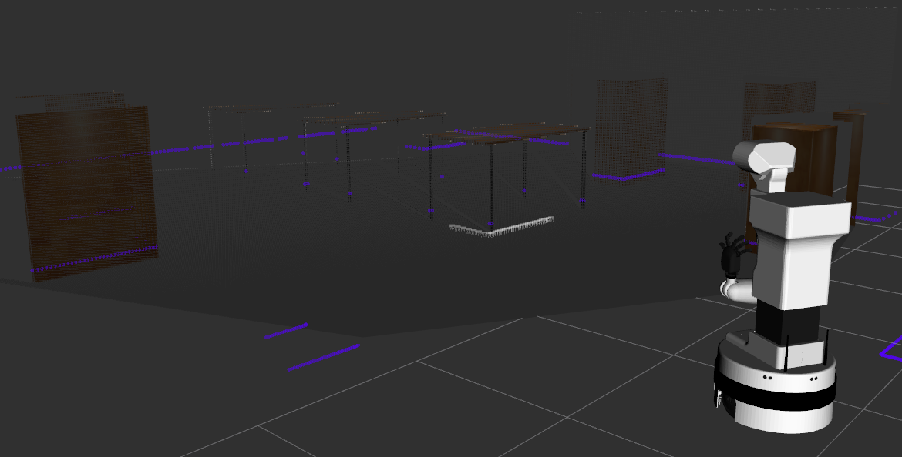
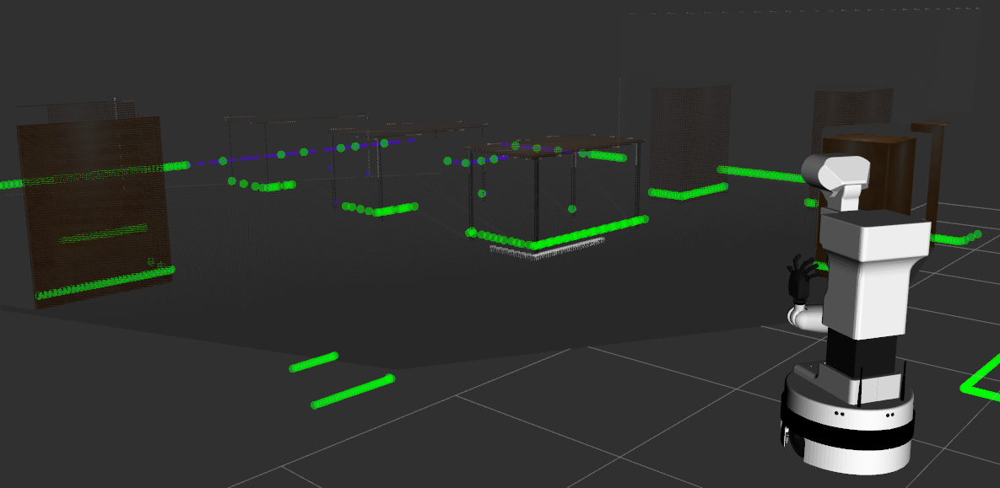

# laser_plane_merger
ROS node that allows to merge two `sensor_msgs/LaserScan`s, projecting them onto a single plane.

First scan is a main one (`main_scan`), the second one is an auxiliary one (`aux_scan`). Merged scan contains ranges projected onto the main scan's plane.

The merging algorithm uses main scan's points as a reference. The merged scan contains only these points from the auxiliary scan that are closer to the sensor frame, compared to the main one.

Sensor model is considered to compare main scan's readings with the closest readings from the auxiliary scan.

A typical application is to set `main_scan` as a LiDAR scan, whereas the second one as a LaserScan retrieved from a RGBD camera (converted from PCL).

Screenshots retrieved from PAL's TiAGo robot simulation.

# Run
The package was tested (so far) under Ubuntu 16.04 and ROS Kinetic.

Node can be run with:

    rosrun laser_plane_merger laser_plane_merger_node scan1:=scan scan2:=rgbd_scan

## Subscribed topics
* `/scan1` ([sensor_msgs/LaserScan](http://docs.ros.org/en/kinetic/api/sensor_msgs/html/msg/LaserScan.html))
* `/scan2` ([sensor_msgs/LaserScan](http://docs.ros.org/en/kinetic/api/sensor_msgs/html/msg/LaserScan.html))
* `/tf` ([tf/tfMessage](http://docs.ros.org/en/kinetic/api/tf/html/msg/tfMessage.html))
* `/tf_static` ([tf2_msgs/TFMessage](http://docs.ros.org/en/kinetic/api/tf2_msgs/html/msg/TFMessage.html))

The node uses [`message_filters::Subscriber`](http://docs.ros.org/en/kinetic/api/message_filters/html/c++/classmessage__filters_1_1Subscriber.html)s with [`ApproximateTime`](http://wiki.ros.org/message_filters/ApproximateTime) synchronization policy so the resultant scan is computed with slower scan's (main or auxiliary) frequency.

## Published topics
* `/scan_merged` ([sensor_msgs/LaserScan](http://docs.ros.org/en/kinetic/api/sensor_msgs/html/msg/LaserScan.html))
* `/laser_plane_merger/marker` ([visualization_msgs/Marker](http://docs.ros.org/en/kinetic/api/visualization_msgs/html/msg/Marker.html))

## Parameters
* ~*scan_main_topic_name* (string, default: "/scan1")
* ~*scan_aux_topic_name* (string, default: "/scan2")
* ~*scan_merged_topic_name* (string, default: "/scan_merged")
* ~*global_frame_name* (string, default: "map")

Parameters default values can easily be remapped as noted in [Run](https://github.com/rayvburn/laser_plane_merger/blob/main/README.md#run) section or with a `launch` file.

# Merging algorithm
TBD (plantuml)
